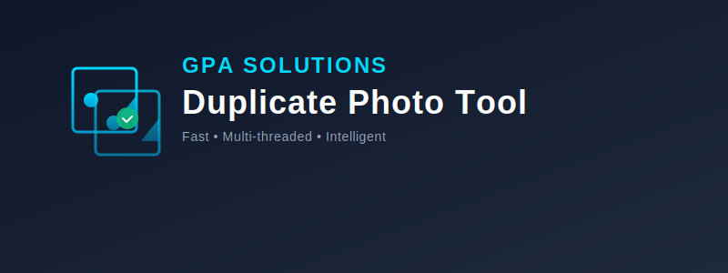

# GPA Solutions – DPT Branding Guide

## Brand Overview

**Brand Name:** GPA SOLUTIONS – Duplicate Photo Tool (DPT)  
**Primary Colors:** Cyan (#00D9FF), Dark Slate (#0F172A), Emerald Green (#10B981)  
**Typography:** Arial/Sans-serif (bold for headers)  
**Visual Theme:** Modern, minimalist, tech-forward

---

## Logo Variations

### 1. **logo-full.svg** - Full Branding Logo
- **Use Case:** Website headers, marketing materials, documentation covers
- **Dimensions:** 800×300px (16:6 aspect ratio)
- **Content:** Company name + product name + tagline + icon
- **Background:** Dark gradient with accent line
- **Suitable for:** Web, print, presentations

### 2. **logo-horizontal.svg** - Horizontal Layout
- **Use Case:** UI headers, dashboard branding, app headers
- **Dimensions:** 600×150px (4:1 aspect ratio)
- **Content:** Icon + abbreviated text
- **Background:** Light background with accent accents
- **Suitable for:** Windows applications, web apps, documentation headers

### 3. **logo-vertical.svg** - Vertical Layout
- **Use Case:** Mobile interfaces, sidebar branding, social media profiles
- **Dimensions:** 200×280px (aspect ratio ~1:1.4)
- **Content:** Icon on top, text below
- **Background:** Light background
- **Suitable for:** App icons, social avatars, thumbnails

### 4. **logo-icon.svg** - Icon Only (Color)
- **Use Case:** Favicon, app launcher, taskbar shortcuts
- **Dimensions:** 256×256px (square)
- **Content:** Icon with checkmark overlay
- **Background:** Dark gradient, rounded corners
- **Suitable for:** Icons, favicons, pinned apps

### 5. **logo-monochrome.svg** - Monochrome Icon
- **Use Case:** Printing, grayscale, accessibility
- **Dimensions:** 256×256px (square)
- **Content:** Single-color icon design
- **Background:** Light background
- **Suitable for:** B&W printing, prints, professional documents

### 6. **favicon.svg** - Favicon Format
- **Use Case:** Browser tab icon, bookmark icon
- **Dimensions:** 128×128px (square)
- **Content:** Simplified icon
- **Background:** Dark with subtle gradient
- **Suitable for:** `<link rel="icon" href="favicon.svg">`

---

## Color Palette

| Color | Hex Code | RGB | Use Case |
|-------|----------|-----|----------|
| **Cyan (Primary)** | #00D9FF | 0, 217, 255 | Accents, logos, highlights |
| **Dark Slate** | #0F172A | 15, 23, 42 | Text, backgrounds, primary |
| **Emerald (Success)** | #10B981 | 16, 185, 129 | Success states, checkmarks |
| **Light Slate** | #E2E8F0 | 226, 232, 240 | Secondary backgrounds |
| **Dark Gray** | #64748B | 100, 116, 139 | Secondary text |
| **White** | #FFFFFF | 255, 255, 255 | Text on dark, highlights |

---

## Typography

- **Logo Text:** Arial Bold, Letter Spacing: 1-2px
- **Company Name:** 24px, letter-spacing: 2px, Cyan
- **Product Name:** 36px, letter-spacing: 1px, White
- **Tagline:** 14px, letter-spacing: 0.5px, Light Gray
- **Accent Line:** 2px solid Cyan gradient

---

## Usage Guidelines

### ✅ DO:
- Use consistent cyan accent color for all branding
- Maintain minimum padding around icons
- Use appropriate logo variant for the context
- Scale logos proportionally
- Use monochrome version for printing

### ❌ DON'T:
- Skew, rotate, or distort logos
- Change colors without reason
- Use on backgrounds with low contrast
- Resize below 128px without simplifying
- Remove the checkmark overlay from main icons

---

## File Export Formats

For different use cases, export SVGs to these formats:

```
logo-icon.svg → PNG 512×512px (icons, app launcher)
favicon.svg → ICO 16×16, 32×32, 64×64px (browser favicon)
logo-monochrome.svg → PDF (print materials)
logo-horizontal.svg → PNG 1200×300px (web header)
```

---

## Integration Examples

### Web Application
```html
<link rel="icon" href="/branding/favicon.svg" type="image/svg+xml">

```

### Windows Shortcut
```powershell
$IconPath = "branding\logo-icon.svg"
$Shortcut.IconLocation = $IconPath
```

### Documentation
```markdown

```

---

## Contact & Questions

For branding inquiries or custom variations, contact **GPA Solutions**.

**Last Updated:** May 8, 2026  
**Version:** 1.0
